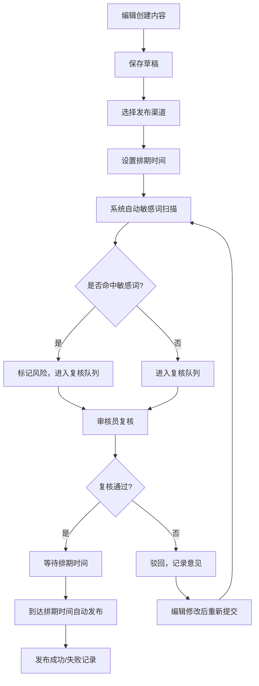
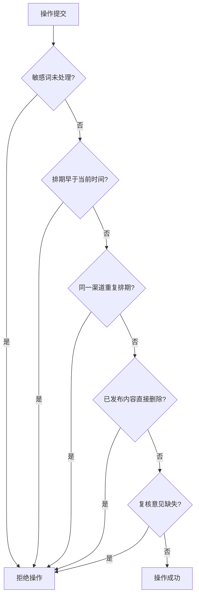
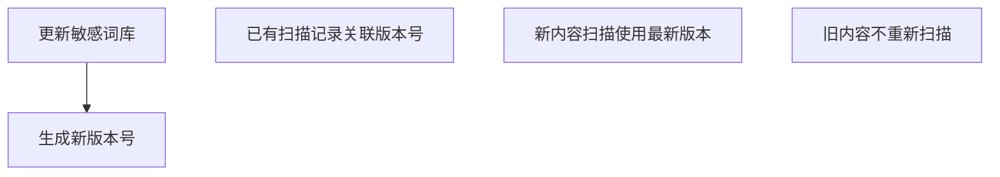

## 1. 产品概述

内容发布排期与敏感词复核系统，为内容编辑团队提供一站式内容创作、排期管理、合规审核和发布全流程管理。系统支持文章、短视频、海报三类内容的创建与多渠道发布，内置敏感词扫描与人工复核机制，确保内容合规发布。

### 1.1 产品目标
- 实现内容从创建到发布的全流程管控
- 确保内容合规性，降低敏感词风险
- 提供可视化排期管理，提升团队协作效率
- 支持数据持久化，确保系统重启后状态一致

## 2. 核心功能

### 2.1 用户角色

| 角色 | 登录方式 | 核心权限 |
|------|------------|------------|
| 编辑 | 用户名密码 | 创建内容、提交排期、查看状态、撤回内容、重新排期 |
| 审核员 | 用户名密码 | 敏感词复核、初审通过/驳回、记录复核意见、查看所有内容 |
| 管理员 | 用户名密码 | 管理敏感词库、查看所有数据、导出发布记录 |

### 2.2 功能模块

1. **内容管理**: 文章/短视频/海报内容创建、编辑、删除、草稿保存
2. **排期管理**: 发布渠道选择、排期时间设置、内容日历视图、重复排期检测
3. **敏感词扫描**: 内容自动扫描、风险词命中明细、词库管理、扫描版本隔离
4. **复核管理**: 待复核队列、初审通过/驳回、处理人记录、意见留存
5. **发布管理**: 定时自动发布、手动撤回、发布状态追踪、渠道状态查看
6. **数据导出**: 发布记录导出CSV、包含渠道/排期/状态/撤回原因
7. **系统管理**: 敏感词库增删改、渠道配置、用户管理

### 2.3 页面详情

| 页面名称 | 模块名称 | 功能描述 |
|-----------|------------|------------------|
| 首页仪表盘 | 数据概览 | 待复核数量、今日排期、敏感词命中统计、发布成功率 |
| 内容创建页 | 内容编辑器 | 支持文章/短视频/海报三种类型，富文本编辑，草稿自动保存 |
| 内容列表页 | 内容管理 | 搜索、筛选、编辑、删除、提交排期 |
| 内容日历页 | 排期日历 | 月/周视图，拖拽调整排期，渠道颜色区分 |
| 待复核队列页 | 复核管理 | 列表展示、详情查看、通过/驳回操作、意见输入 |
| 敏感词管理页 | 词库管理 | 敏感词增删改、分类管理、扫描历史 |
| 风险词明细页 | 命中记录 | 命中词、内容标题、命中位置、处理状态 |
| 发布记录页 | 历史记录 | 发布记录列表、筛选、导出CSV |
| 渠道管理页 | 渠道配置 | 渠道增删改、状态查看 |
| 登录页 | 用户认证 | 用户名密码登录、角色区分 |

## 3. 核心流程

### 3.1 内容发布主流程

### 3.2 拒绝规则触发条件

### 3.3 敏感词更新隔离流程

## 4. 用户界面设计

### 4.1 设计风格

- **主色调**: 深蓝 `#1e3a5f` 作为主色，代表专业与可信赖
- **辅助色**: 橙色 `#f59e0b` 用于警告与强调，绿色 `#10b981` 表示通过，红色 `#ef4444` 表示拒绝
- **中性色**: 深灰 `#1f2937` 文字，浅灰 `#f3f4f6` 背景
- **按钮风格**: 圆角4px，微阴影，悬停上浮效果
- **字体**: 系统无衬线字体，标题18-24px，正文14px
- **布局风格**: 卡片式布局，顶部导航+侧边栏，清晰的模块划分
- **图标风格**: lucide-react 线性图标

### 4.2 页面设计概览

| 页面名称 | 模块名称 | UI元素 |
|-----------|------------|------------|
| 仪表盘 | 数据卡片 | 渐变背景卡片、数据动画、趋势图表、统计数字 |
| 内容创建 | 表单区域 | 标签页切换内容类型、富文本编辑器、拖拽上传、实时预览 |
| 内容日历 | 日历组件 | 月视图网格、事件卡片、拖拽交互、颜色编码渠道 |
| 复核队列 | 任务列表 | 风险等级标签、快捷操作按钮、意见输入模态框 |
| 敏感词管理 | 词库表格 | 搜索过滤、批量操作、版本历史、导入导出 |

### 4.3 响应式设计

- 桌面端优先设计（1280px+）
- 侧边栏在平板端折叠为图标
- 移动端单列布局，底部导航
- 触摸操作优化，增大点击区域

## 5. 验收标准

### 5.1 功能验收
- ✅ 内容创建：支持文章、短视频、海报三种类型
- ✅ 敏感词扫描：自动扫描并标记风险内容
- ✅ 复核流程：待复核队列、初审通过/驳回、记录处理人和意见
- ✅ 排期管理：内容日历、定时发布、重复排期检测
- ✅ 发布管理：自动发布、撤回、重新排期
- ✅ 拒绝规则：5种拒绝场景全部覆盖
- ✅ 数据导出：CSV导出包含所有要求字段
- ✅ 数据持久化：重启后草稿、复核状态、排期任务、导出记录保持一致
- ✅ 敏感词版本隔离：词库更新后只影响新扫描内容

### 5.2 非功能验收
- ✅ 界面美观，符合设计规范
- ✅ 响应式布局适配多端
- ✅ 操作流畅，无明显卡顿
- ✅ 数据安全，权限隔离
