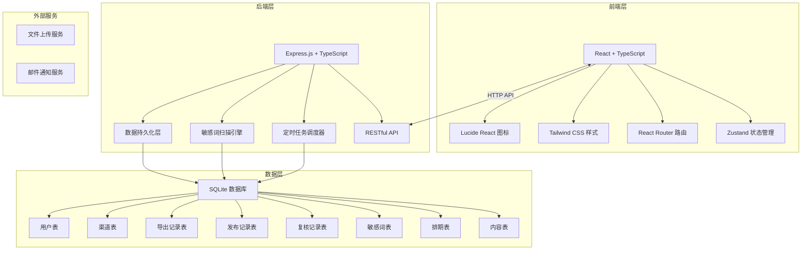
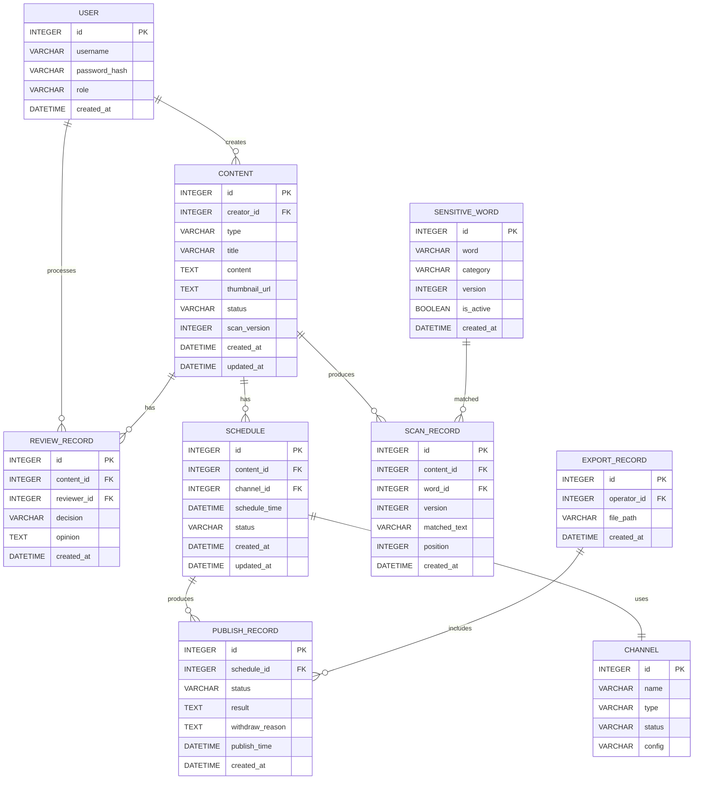
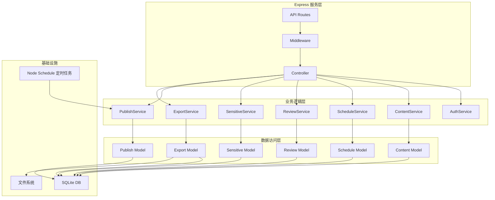
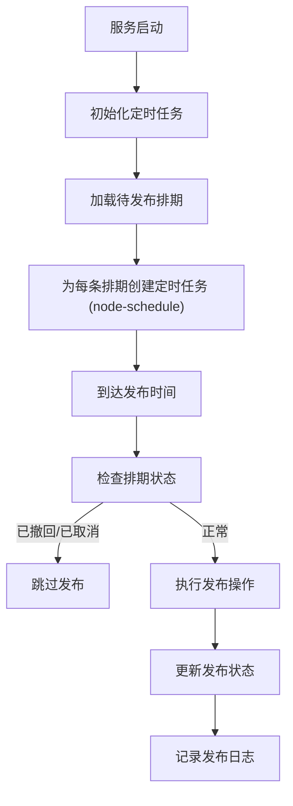

## 1. 架构设计



## 2. 技术描述

### 2.1 技术栈选型
- **前端**: React@18 + TypeScript + Vite
- **后端**: Express@4 + TypeScript
- **状态管理**: Zustand@4
- **路由**: React Router DOM@6
- **样式**: Tailwind CSS@3
- **图标**: Lucide React
- **数据库**: SQLite3 + better-sqlite3
- **定时任务**: Node Schedule
- **CSV导出**: Papa Parse
- **HTTP客户端**: Axios
- **包管理器**: pnpm

### 2.2 项目初始化
- 使用 `pnpm create vite-init@latest . --template react-express-ts --force` 初始化项目
- 数据库文件存储在 `data/app.db`
- 定时任务在服务启动时自动初始化

## 3. 目录结构

```
├── src/                          # 前端源码
│   ├── components/               # 公共组件
│   │   ├── Layout.tsx           # 页面布局
│   │   ├── Sidebar.tsx          # 侧边栏
│   │   ├── Navbar.tsx           # 顶部导航
│   │   ├── ContentCard.tsx      # 内容卡片
│   │   ├── Calendar.tsx         # 日历组件
│   │   ├── Modal.tsx            # 模态框
│   │   ├── StatusBadge.tsx      # 状态标签
│   │   └── Table.tsx            # 表格组件
│   ├── pages/                    # 页面组件
│   │   ├── Dashboard.tsx        # 仪表盘
│   │   ├── ContentCreate.tsx    # 内容创建
│   │   ├── ContentList.tsx      # 内容列表
│   │   ├── ContentCalendar.tsx  # 内容日历
│   │   ├── ReviewQueue.tsx      # 待复核队列
│   │   ├── SensitiveWords.tsx   # 敏感词管理
│   │   ├── RiskDetails.tsx      # 风险词明细
│   │   ├── PublishRecords.tsx   # 发布记录
│   │   ├── ChannelManage.tsx    # 渠道管理
│   │   └── Login.tsx            # 登录页
│   ├── store/                    # 状态管理
│   │   ├── useAuthStore.ts      # 认证状态
│   │   ├── useContentStore.ts   # 内容状态
│   │   ├── useScheduleStore.ts  # 排期状态
│   │   └── useReviewStore.ts    # 复核状态
│   ├── api/                      # API接口
│   │   ├── auth.ts              # 认证接口
│   │   ├── content.ts           # 内容接口
│   │   ├── schedule.ts          # 排期接口
│   │   ├── review.ts            # 复核接口
│   │   ├── sensitive.ts         # 敏感词接口
│   │   └── export.ts            # 导出接口
│   ├── types/                    # 类型定义
│   │   └── index.ts             # 共享类型
│   ├── utils/                    # 工具函数
│   │   ├── request.ts           # HTTP请求
│   │   ├── date.ts              # 日期处理
│   │   └── validator.ts         # 表单验证
│   ├── App.tsx                  # 根组件
│   ├── main.tsx                 # 入口文件
│   └── index.css                # 全局样式
├── api/                          # 后端源码
│   ├── src/
│   │   ├── routes/              # 路由层
│   │   │   ├── auth.ts          # 认证路由
│   │   │   ├── content.ts       # 内容路由
│   │   │   ├── schedule.ts      # 排期路由
│   │   │   ├── review.ts        # 复核路由
│   │   │   ├── sensitive.ts     # 敏感词路由
│   │   │   ├── channel.ts       # 渠道路由
│   │   │   └── export.ts        # 导出路由
│   │   ├── services/            # 业务逻辑层
│   │   │   ├── AuthService.ts   # 认证服务
│   │   │   ├── ContentService.ts # 内容服务
│   │   │   ├── ScheduleService.ts # 排期服务
│   │   │   ├── ReviewService.ts # 复核服务
│   │   │   ├── SensitiveService.ts # 敏感词服务
│   │   │   ├── PublishService.ts # 发布服务
│   │   │   └── ExportService.ts # 导出服务
│   │   ├── models/              # 数据模型
│   │   │   ├── db.ts            # 数据库连接
│   │   │   ├── init.ts          # 数据库初始化
│   │   │   ├── seed.ts          # 种子数据
│   │   │   ├── User.ts          # 用户模型
│   │   │   ├── Content.ts       # 内容模型
│   │   │   ├── Schedule.ts      # 排期模型
│   │   │   ├── SensitiveWord.ts # 敏感词模型
│   │   │   ├── ScanRecord.ts    # 扫描记录模型
│   │   │   ├── ReviewRecord.ts  # 复核记录模型
│   │   │   ├── PublishRecord.ts # 发布记录模型
│   │   │   ├── ExportRecord.ts  # 导出记录模型
│   │   │   └── Channel.ts       # 渠道模型
│   │   ├── middleware/          # 中间件
│   │   │   ├── auth.ts          # 认证中间件
│   │   │   ├── validate.ts      # 验证中间件
│   │   │   └── error.ts         # 错误处理
│   │   ├── scheduler/           # 定时任务
│   │   │   └── publishTask.ts   # 发布任务调度
│   │   ├── types/               # 类型定义
│   │   │   └── index.ts         # 共享类型
│   │   ├── utils/               # 工具函数
│   │   │   ├── validator.ts     # 业务规则验证
│   │   │   ├── scanner.ts       # 敏感词扫描器
│   │   │   └── csv.ts           # CSV导出
│   │   └── index.ts             # 服务入口
├── shared/                       # 前后端共享
│   └── types.ts                  # 共享类型定义
├── data/                         # 数据目录
│   └── app.db                    # SQLite数据库
├── migrations/                   # 数据库迁移
│   └── 001_init.sql             # 初始化脚本
├── vite.config.ts               # Vite配置
├── tailwind.config.js           # Tailwind配置
├── tsconfig.json                # TypeScript配置
└── package.json                 # 项目依赖
```

## 4. 路由定义

### 4.1 前端路由

| 路由路径 | 页面组件 | 权限要求 |
|-----------|------------|------------|
| `/login` | Login | 公开 |
| `/dashboard` | Dashboard | 已登录 |
| `/content/create` | ContentCreate | 编辑/管理员 |
| `/content/list` | ContentList | 已登录 |
| `/content/calendar` | ContentCalendar | 已登录 |
| `/review/queue` | ReviewQueue | 审核员/管理员 |
| `/sensitive/words` | SensitiveWords | 管理员 |
| `/sensitive/details` | RiskDetails | 审核员/管理员 |
| `/publish/records` | PublishRecords | 已登录 |
| `/channels` | ChannelManage | 管理员 |

### 4.2 后端API路由

| 方法 | 路径 | 描述 |
|--------|--------|--------|
| POST | `/api/auth/login` | 用户登录 |
| GET | `/api/auth/profile` | 获取当前用户 |
| GET | `/api/content` | 获取内容列表 |
| POST | `/api/content` | 创建内容 |
| GET | `/api/content/:id` | 获取内容详情 |
| PUT | `/api/content/:id` | 更新内容 |
| DELETE | `/api/content/:id` | 删除内容 |
| POST | `/api/content/:id/submit` | 提交排期 |
| GET | `/api/schedule` | 获取排期列表 |
| POST | `/api/schedule` | 创建排期 |
| PUT | `/api/schedule/:id` | 更新排期（重新排期） |
| DELETE | `/api/schedule/:id` | 撤回排期 |
| GET | `/api/review/queue` | 获取待复核队列 |
| POST | `/api/review/:id/approve` | 复核通过 |
| POST | `/api/review/:id/reject` | 复核驳回 |
| GET | `/api/sensitive/words` | 获取敏感词库 |
| POST | `/api/sensitive/words` | 新增敏感词 |
| PUT | `/api/sensitive/words/:id` | 更新敏感词 |
| DELETE | `/api/sensitive/words/:id` | 删除敏感词 |
| GET | `/api/sensitive/scans` | 获取扫描记录 |
| GET | `/api/channels` | 获取渠道列表 |
| POST | `/api/channels` | 新增渠道 |
| PUT | `/api/channels/:id` | 更新渠道 |
| DELETE | `/api/channels/:id` | 删除渠道 |
| GET | `/api/publish/records` | 获取发布记录 |
| GET | `/api/export/publish` | 导出发布记录CSV |
| GET | `/api/export/records` | 获取导出历史 |

## 5. 数据模型

### 5.1 ER图



### 5.2 核心业务规则验证

在 `api/src/utils/validator.ts` 中实现以下验证逻辑：

1. **敏感词未处理拒绝**：内容提交排期时，检查是否存在未处理的敏感词命中记录
2. **排期早于当前时间拒绝**：排期时间必须晚于当前时间
3. **同一渠道重复排期拒绝**：检查同一渠道同一时间是否已有排期
4. **已发布内容直接删除拒绝**：已发布内容不允许直接删除，需先撤回
5. **复核意见缺失拒绝**：驳回操作必须填写复核意见

### 5.3 敏感词版本隔离机制

- 每次更新敏感词库时，版本号递增
- 扫描记录关联扫描时的版本号
- 已扫描内容不随词库更新而重新扫描
- 新提交内容使用最新版本词库扫描

## 6. 服务架构



## 7. 定时任务架构



## 8. 数据持久化保证

- SQLite 数据库文件存储在 `data/app.db`
- 所有写操作使用事务保证原子性
- 服务启动时检查数据库并自动建表
- 定时任务状态持久化，重启后自动恢复
- 导出文件存储在 `data/exports/` 目录
